# ShopEasy — Project Overview & Roadmap
> เวอร์ชัน: พฤษภาคม 2026 | Branch: `final-shop`  
> ครอบคลุมทุกส่วน: Architecture · DB · AI Pipeline · Frontend · API · Roadmap

---

## สารบัญ

1. [ภาพรวมระบบ (High-Level)](#1-ภาพรวมระบบ)
2. [Tech Stack](#2-tech-stack)
3. [โครงสร้างโปรเจกต์](#3-โครงสร้างโปรเจกต์)
4. [Database Schema](#4-database-schema)
5. [Backend — Service Layer](#5-backend--service-layer)
6. [AI Pipeline (LangGraph)](#6-ai-pipeline-langgraph)
7. [Policy RAG System](#7-policy-rag-system)
8. [Frontend — 3 Portals](#8-frontend--3-portals)
9. [API Endpoints](#9-api-endpoints)
10. [Docker Services](#10-docker-services)
11. [Git Branches & Commit History](#11-git-branches--commit-history)
12. [สิ่งที่ทำงานแล้ว (Done ✅)](#12-สิ่งที่ทำงานแล้ว-done-)
13. [Roadmap — สิ่งที่ต้องทำต่อ (WOW Features)](#13-roadmap--สิ่งที่ต้องทำต่อ-wow-features)

---

## 1. ภาพรวมระบบ

ShopEasy คือแพลตฟอร์ม E-Commerce ที่มี **Agentic AI Customer Support** ฝังอยู่ในตัว ลูกค้าไม่ต้องรอ agent มนุษย์ — AI จัดการได้ทุก workflow อัตโนมัติ

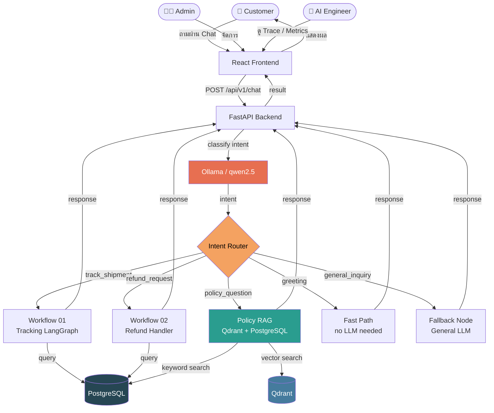

---

## 2. Tech Stack

| Layer | Technology | Notes |
|-------|-----------|-------|
| **Frontend** | React 18 + TypeScript + Vite | SPA, Tailwind-like custom CSS |
| **Backend** | FastAPI + Python 3.11 | Async-ready, Pydantic v2 |
| **ORM** | SQLAlchemy 2.0 + Alembic | Type-safe models, migrations |
| **Database** | PostgreSQL 16 | Main data store |
| **Vector DB** | Qdrant | Policy RAG embeddings |
| **Object Storage** | MinIO | Policy PDF files |
| **Cache / Queue** | Redis | Session, rate limit |
| **AI Orchestration** | LangGraph | Stateful multi-node graph |
| **LLM** | Ollama (qwen2.5:1.5b) | Local CPU inference |
| **Embeddings** | Ollama (nomic-embed-text) | For Qdrant vector search |
| **Container** | Docker Compose | 6-service stack |
| **Auth** | JWT (python-jose) | Role-based: customer / admin / ai_engineer |

---

## 3. โครงสร้างโปรเจกต์

```
ShopEasy/
├── backend/
│   ├── app/
│   │   ├── main.py                  # FastAPI entry point
│   │   ├── agents/                  # AI Agent layer
│   │   │   ├── graph.py             # LangGraph workflow definition
│   │   │   ├── llm.py               # LLM client + System Prompts
│   │   │   ├── state.py             # GraphState TypedDict
│   │   │   ├── nodes/
│   │   │   │   └── tracking_nodes.py  # All LangGraph nodes
│   │   │   ├── tools/
│   │   │   │   ├── tracking.py      # Tracking helper functions
│   │   │   │   ├── refund.py        # Refund + intent detection
│   │   │   │   └── proactive.py     # Proactive alert tools
│   │   │   └── memory/
│   │   │       ├── short_term.py    # Redis-based session memory
│   │   │       └── long_term.py     # DB-based customer memory
│   │   ├── api/
│   │   │   ├── router.py            # API route registration
│   │   │   └── routes/              # Endpoint handlers
│   │   ├── services/
│   │   │   ├── chat.py              # Main chat handler + intent router
│   │   │   ├── policy_rag.py        # RAG search (hybrid vector+keyword)
│   │   │   ├── workflow_01_tracking.py
│   │   │   └── workflow_02_refund.py
│   │   ├── db/
│   │   │   ├── models/              # SQLAlchemy models
│   │   │   └── seeds/               # Demo data
│   │   └── repositories/            # DB query layer
├── frontend/
│   └── src/
│       ├── pages/
│       │   ├── customer/CustomerPortal.tsx
│       │   ├── admin/AdminPortal.tsx
│       │   └── ai/AiControlPortal.tsx
│       └── components/
├── docker-compose.yml
└── docs/
```

---

## 4. Database Schema

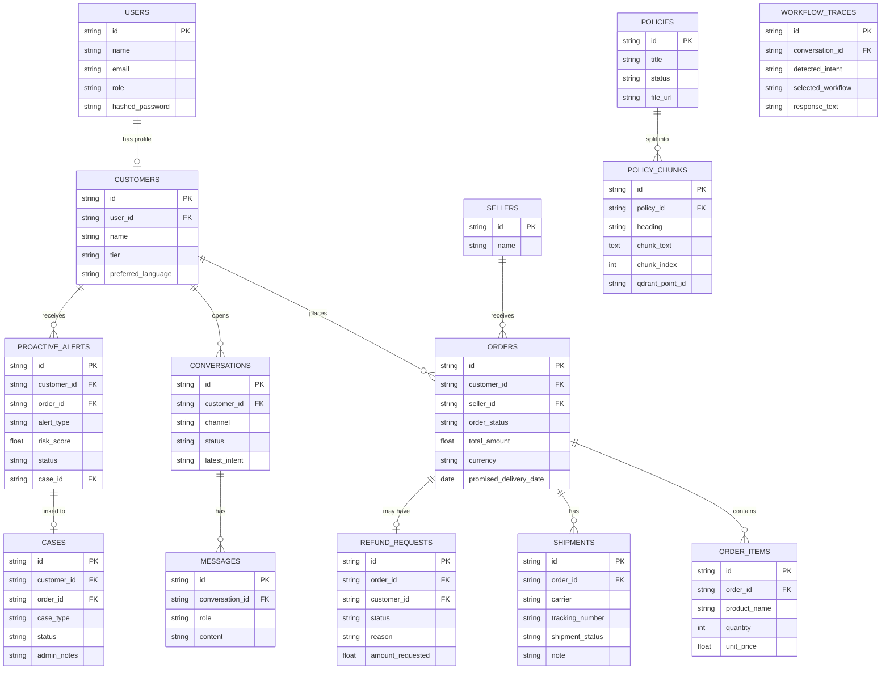

---

## 5. Backend — Service Layer

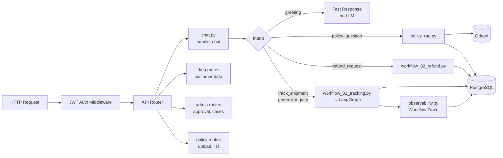

---

## 6. AI Pipeline (LangGraph)

LangGraph คือ state machine ที่ควบคุมการทำงานของ AI nodes แต่ละตัว:

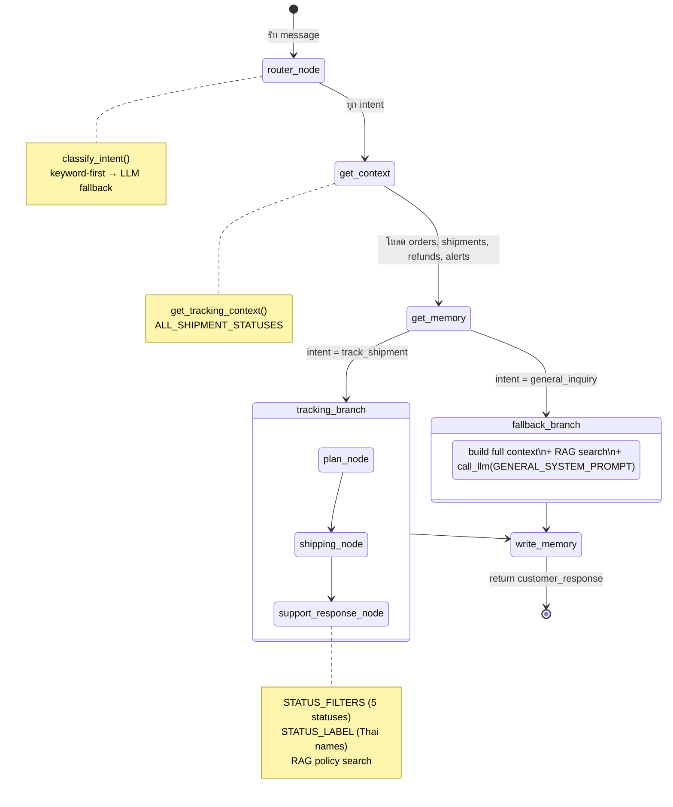

### Intent Classification

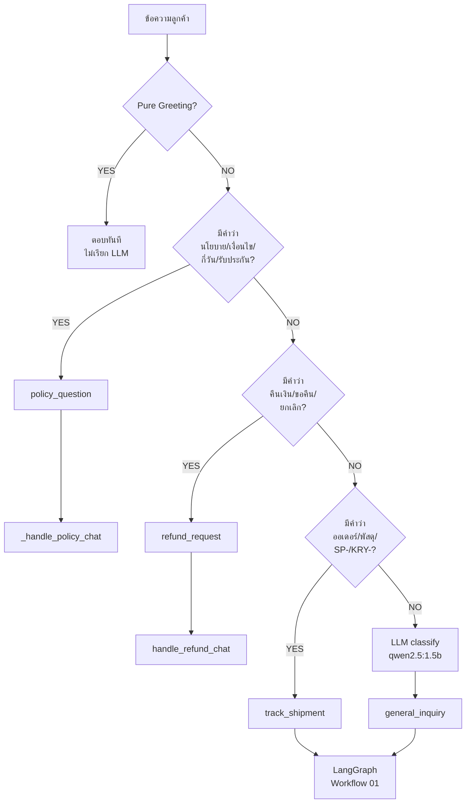

---

## 7. Policy RAG System

```mermaid
flowchart TD
    UPLOAD[Admin อัปโหลด PDF] --> EXTRACT[pdf_extractor.py\nแยกข้อความ + chunks]
    EXTRACT --> EMBED[Ollama\nnomic-embed-text\nสร้าง vector]
    EMBED --> QDRANT[(Qdrant\npolicy_chunks collection)]
    EXTRACT --> PG_CHUNK[(PostgreSQL\npolicy_chunks table)]

    QUERY[ลูกค้าถาม\n"นโยบายคืนเงิน"] --> TOKENIZE[_tokenize_query()\nตัดคำ Thai + stopwords]
    TOKENIZE --> HYBRID{Hybrid Search}

    HYBRID -->|vector search| QDRANT
    HYBRID -->|keyword ILIKE| PG_CHUNK
    QDRANT --> MERGE[Deduplicate\nby policy_id + chunk_index]
    PG_CHUNK --> MERGE
    MERGE --> LLM_RAG[call_llm()\nqwen2.5 + context]
    LLM_RAG --> RESP[ตอบลูกค้า\nอ้างอิงนโยบายจริง]

    style QDRANT fill:#457b9d,color:#fff
    style PG_CHUNK fill:#264653,color:#fff
```

### Tokenizer Logic

ปัญหาภาษาไทย: ไม่มี word space → ต้องตัดคำเอง

```python
# ตัวอย่าง: "นโยบายการคืนเงินคือ"
_tokenize_query() →
  strip stopwords: ["นโยบาย", "คือ"]
  remaining: ["การคืนเงิน", "คืนเงิน"]
  search ILIKE: %การคืนเงิน%, %คืนเงิน%
```

---

## 8. Frontend — 3 Portals

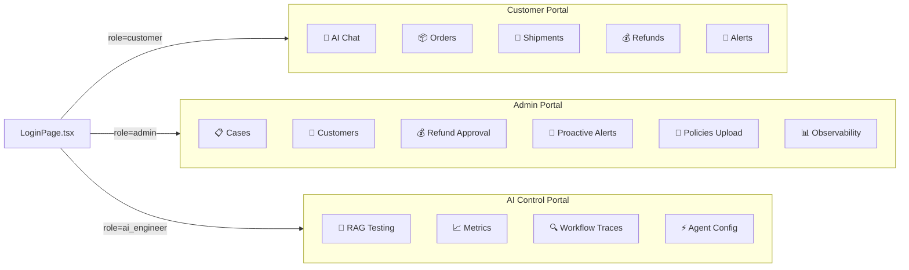

### Customer Portal — Chat Flow

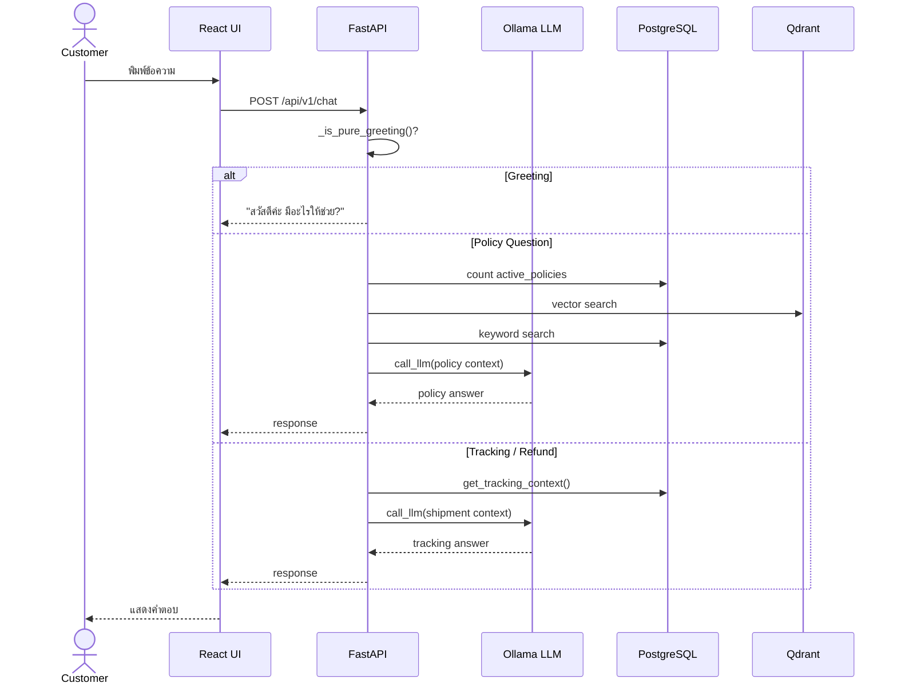

---

## 9. API Endpoints

| Method | Path | Description |
|--------|------|-------------|
| POST | `/api/v1/auth/login` | Login → JWT token |
| POST | `/api/v1/chat` | Main AI chat endpoint |
| GET | `/api/v1/data/customers/{id}/orders` | ออเดอร์ของลูกค้า |
| GET | `/api/v1/data/customers/{id}/shipments` | พัสดุของลูกค้า |
| GET | `/api/v1/data/customers/{id}/conversations` | ประวัติแชท |
| GET | `/api/v1/data/customers/{id}/refund-requests` | คำขอคืนเงิน |
| GET | `/api/v1/data/customers/{id}/proactive-alerts` | การแจ้งเตือน |
| GET | `/api/v1/data/shipments/{id}` | รายละเอียดพัสดุ |
| POST | `/api/v1/admin/policies` | อัปโหลด policy PDF |
| GET | `/api/v1/admin/policies` | รายการ policies |
| GET | `/api/v1/admin/cases` | รายการ cases |
| PATCH | `/api/v1/admin/refunds/{id}/approve` | อนุมัติคืนเงิน |
| GET | `/api/v1/observability/traces` | AI workflow traces |
| GET | `/api/v1/health` | Health check |

---

## 10. Docker Services

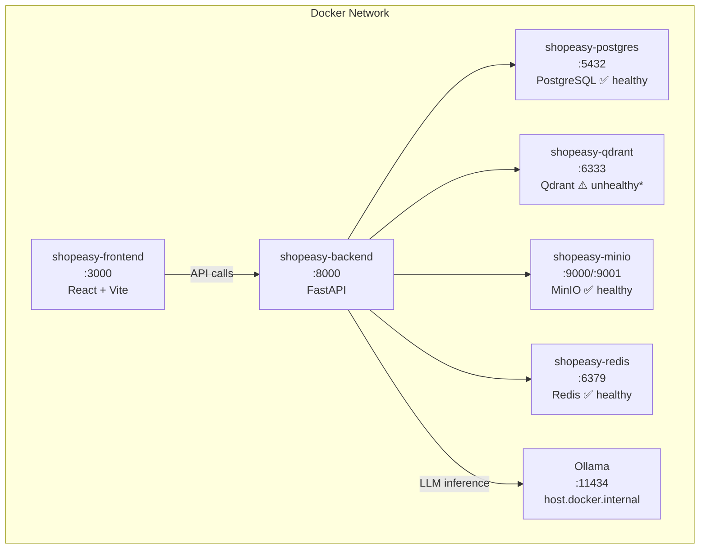

> ⚠️ **Qdrant unhealthy**: healthcheck config ใน docker-compose ผิด แต่ vector search ทำงานได้ปกติ (ทดสอบยืนยันแล้ว)

---

## 11. Git Branches & Commit History

| Branch | Status | Notes |
|--------|--------|-------|
| `main` | stable | Last commit: `efc7eea` |
| `final-shop` | **active** ← current | All new features here |

### Recent Changes (final-shop)
```
60390ee  feat: final-shop - intent routing, alert fixes, status filters, policy RAG
         ├── backend/app/agents/llm.py          — system prompts + ค่ะ-only rule
         ├── backend/app/services/chat.py        — greeting fast-path + intent router
         ├── backend/app/services/policy_rag.py  — Thai tokenizer + hybrid search
         ├── backend/app/agents/nodes/tracking_nodes.py — STATUS_FILTERS (5 statuses)
         ├── backend/app/repositories/tracking.py       — ALL_SHIPMENT_STATUSES
         └── frontend/src/pages/admin/AdminPortal.tsx   — Open Case button + alerts UI
```

### Uncommitted Changes (ยังไม่ได้ commit)
- `backend/app/agents/llm.py` — เพิ่ม `[CRITICAL] ใช้ "ค่ะ" เท่านั้น`
- `backend/app/services/chat.py` — `_is_pure_greeting()` fast path
- `frontend/src/pages/admin/AdminPortal.tsx` — remove Open badge

---

## 12. สิ่งที่ทำงานแล้ว (Done ✅)

| Feature | Status |
|---------|--------|
| Customer AI Chat (Tracking) | ✅ ทำงาน |
| Customer AI Chat (Refund) | ✅ ทำงาน |
| Customer AI Chat (Policy RAG) | ✅ ทำงาน |
| Greeting fast-path (ไม่เรียก LLM) | ✅ ทำงาน |
| ตอบ "ค่ะ" เท่านั้น | ✅ ทำงาน |
| Status filter (จัดเตรียม/จัดส่ง/สำเร็จ/ยกเลิก/ล่าช้า) | ✅ ทำงาน |
| Thai tokenizer สำหรับ RAG | ✅ ทำงาน |
| Policy hybrid search (vector + keyword) | ✅ ทำงาน |
| Admin Portal — Cases / Customers | ✅ ทำงาน |
| Admin Portal — Refund Approval | ✅ ทำงาน |
| Admin Portal — Proactive Alerts (Open Case / Resolve) | ✅ ทำงาน |
| Admin Portal — Policy Upload | ✅ ทำงาน |
| AI Engineer Portal — RAG Testing | ✅ ทำงาน |
| AI Engineer Portal — Workflow Traces | ✅ ทำงาน |
| JWT Auth (3 roles) | ✅ ทำงาน |
| Docker 6-service stack | ✅ ทำงาน |

---

## 13. Roadmap — สิ่งที่ต้องทำต่อ (WOW Features)

### Priority Matrix

```mermaid
quadrantChart
    title WOW Feature Priority (Impact vs Effort)
    x-axis Low Effort --> High Effort
    y-axis Low Impact --> High Impact
    quadrant-1 Do First
    quadrant-2 Plan Carefully
    quadrant-3 Fill-ins
    quadrant-4 Reconsider

    Real-time Chat (WebSocket): [0.35, 0.92]
    Multi-language Support (EN): [0.30, 0.75]
    Commit Uncommitted Changes: [0.05, 0.80]
    Fix Qdrant Healthcheck: [0.10, 0.55]
    Chat History Scroll (persist): [0.20, 0.70]
    Order Status Push Notification: [0.50, 0.85]
    Admin Dashboard Analytics: [0.55, 0.78]
    AI Confidence Score Display: [0.40, 0.65]
    Proactive Alert Auto-trigger: [0.60, 0.88]
    Shopify Integration (live sync): [0.85, 0.90]
    Mobile Responsive UI: [0.45, 0.72]
    Rate Limiting per User: [0.25, 0.60]
```

---

### Phase 1 — Quick Wins (ทำได้เลย)

#### 1.1 Commit uncommitted changes
```
git add .
git commit -m "fix: greeting fast-path, ค่ะ-only rule, remove Open badge"
git push origin final-shop
```

#### 1.2 Fix Qdrant healthcheck (docker-compose.yml)
```yaml
# เปลี่ยน healthcheck ให้ถูก
healthcheck:
  test: ["CMD", "curl", "-f", "http://localhost:6333/healthz"]
  interval: 30s
  timeout: 10s
  retries: 3
```

#### 1.3 Chat History — persist & scroll back
- บันทึก messages ลง DB (`messages` table) สำหรับ policy + greeting workflows
- Frontend โหลด history เมื่อเปิด conversation เดิม

#### 1.4 Typing Indicator
- แสดง "AI กำลังพิมพ์..." ระหว่างรอ LLM (~30-90s บน Ollama)

---

### Phase 2 — WOW UI/UX (1-2 สัปดาห์)

#### 2.1 Real-time Chat (WebSocket)
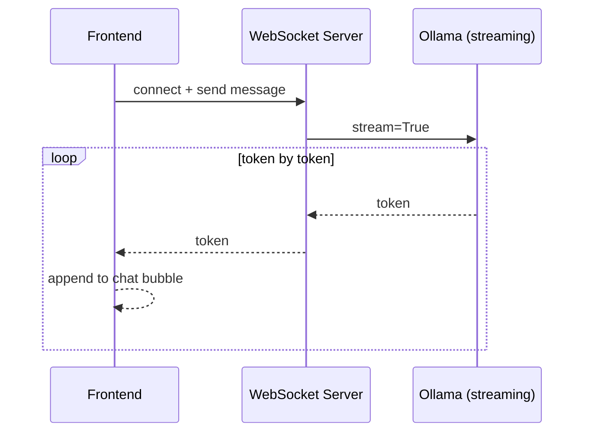
- ใช้ FastAPI `WebSocket` + `StreamingResponse`
- Ollama รองรับ streaming แล้ว
- ผลลัพธ์: ตัวอักษรพิมพ์ทีละตัวเหมือน ChatGPT

#### 2.2 AI Confidence Score
- แสดง `confidence` badge ข้างคำตอบ AI
- ถ้า score < 0.5 → แสดง "⚠️ ควรยืนยันกับเจ้าหน้าที่"
- คำนวณจาก: Qdrant similarity score + intent certainty

#### 2.3 Mobile Responsive
- ปัจจุบัน UI ออกแบบสำหรับ desktop เท่านั้น
- เพิ่ม responsive breakpoints (768px, 480px)
- Customer Portal ต้องใช้งานบนมือถือได้สะดวก

#### 2.4 Admin Dashboard Analytics
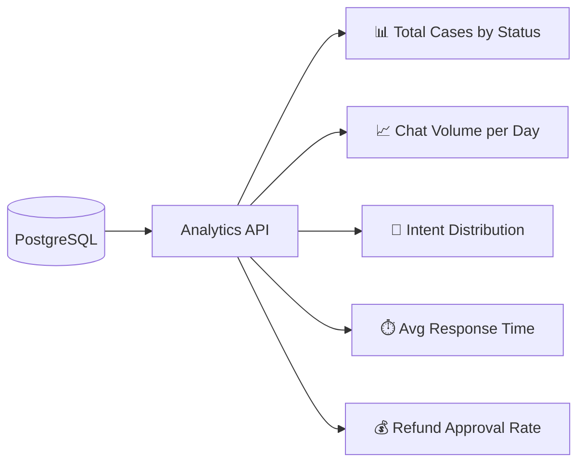

---

### Phase 3 — Agentic WOW (2-4 สัปดาห์)

#### 3.1 Proactive Alert Auto-trigger
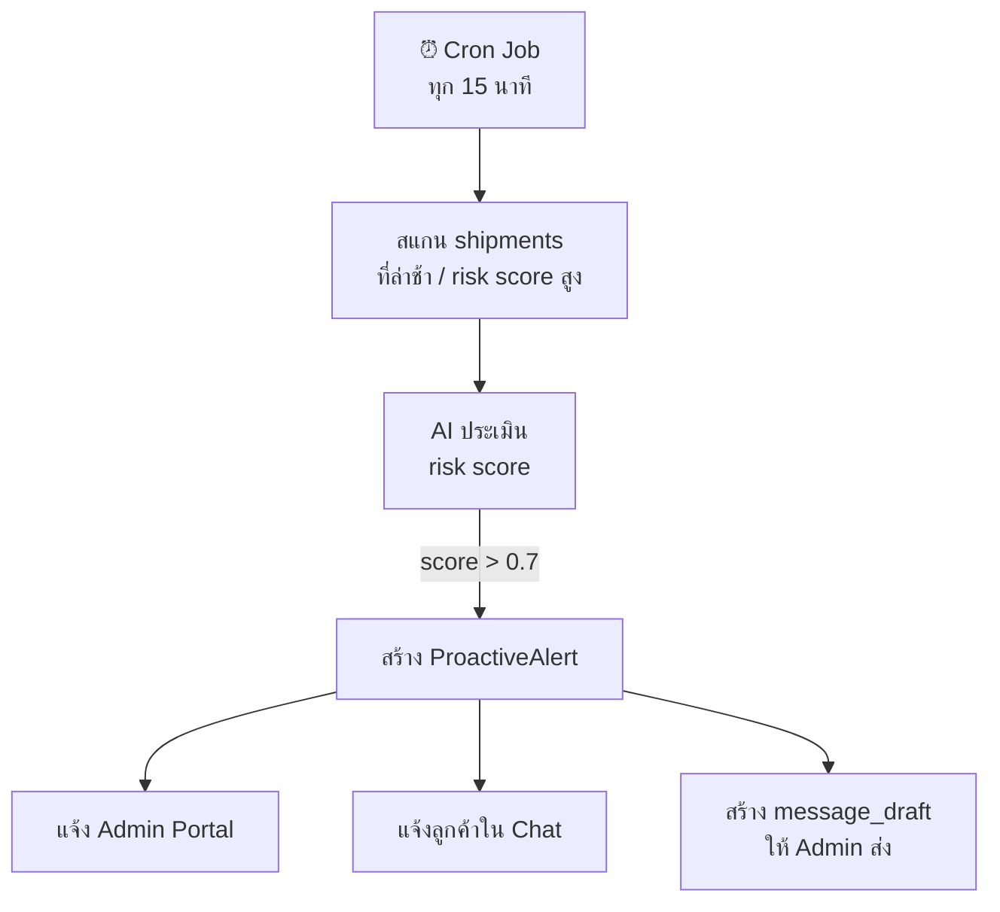
- ปัจจุบัน: Alert สร้างจาก seed data เท่านั้น
- WOW: AI สแกนอัตโนมัติ + แจ้งเตือน real-time

#### 3.2 Multi-turn Memory (Long-term)
- ปัจจุบัน: จำได้แค่ใน session เดียว
- WOW: AI จำประวัติลูกค้าข้ามหลาย session
- เช่น: "ครั้งก่อนคุณถามเรื่อง SP-1024 ที่ล่าช้า ตอนนี้ได้รับแล้วนะคะ"

#### 3.3 Order Status Push Notification
```mermaid
flowchart LR
    DB[(Shipment Status\nChanged)] --> WEBHOOK[Webhook Handler]
    WEBHOOK --> REDIS[(Redis Pub/Sub)]
    REDIS --> WS[WebSocket Server]
    WS --> FE[Frontend\nCustomer Portal]
    FE --> TOAST[🔔 Toast Notification\n"พัสดุ SP-1024 จัดส่งแล้วค่ะ"]
```

#### 3.4 Shopify Live Sync
- Connect ไป Shopify API webhook
- sync orders/shipments แบบ real-time
- ปัจจุบันใช้ `shopify_order_id` column แต่ยังไม่ sync

---

### Phase 4 — Production Ready

#### 4.1 Rate Limiting
```python
# เพิ่มใน FastAPI middleware
@app.middleware("http")
async def rate_limit(request, call_next):
    # 30 requests/minute per user
```

#### 4.2 OpenAI API Upgrade
- ปัจจุบัน: Ollama qwen2.5:1.5b (CPU, ~30-90s/call)
- Production: GPT-4o-mini (~1-3s/call)
- Config ใน `.env`: `OPENAI_API_KEY=sk-...`
- Code รองรับแล้ว — ไม่ต้องแก้ code เลย

#### 4.3 Merge final-shop → main
```bash
git checkout main
git merge final-shop
git push origin main
```

#### 4.4 CI/CD Pipeline (GitHub Actions)
```yaml
on: push to main
jobs:
  test: pytest backend/tests/
  build: docker build + push to registry
  deploy: docker compose pull + up -d
```

---

## สรุป Roadmap Timeline

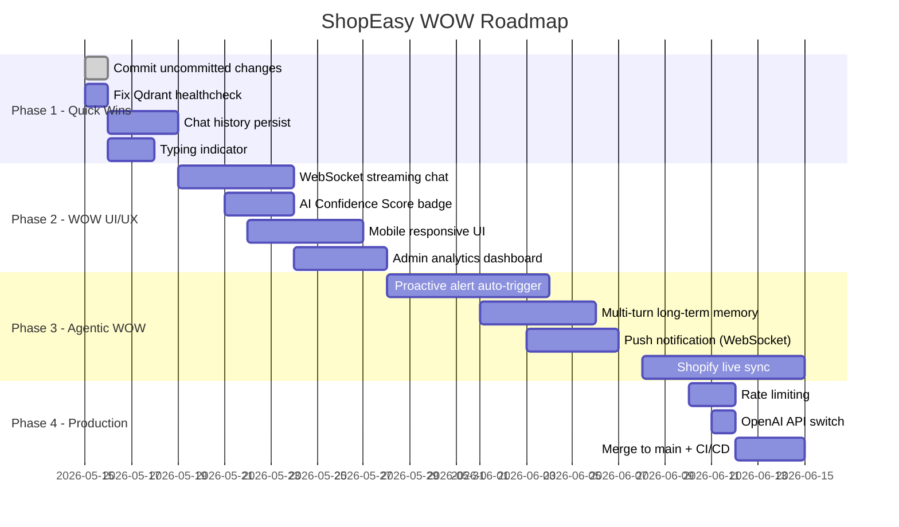

---

> **สถานะปัจจุบัน**: Branch `final-shop` | 3 files uncommitted | ทุก workflow ทดสอบผ่านแล้ว  
> **Next action**: Commit + push → แล้วเริ่ม Phase 1 Quick Wins
